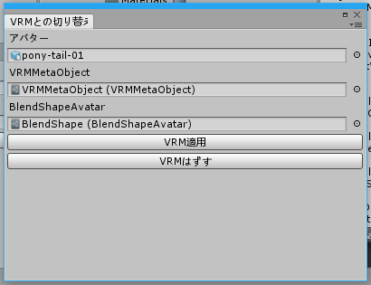

# VRChatVRM.cs

VRChatのアバターをそのままVRMとして使う時の雑なコンポーネント付け外しスクリプト

## こういうやつ

## 使い方

0. Editorフォルダをどこかに作っててきとうにUnityにつっこむ。UniVRM入ってる前提。
1. VRMMetaObjectがアセットのメニューから作れるようになってるんで、そこに説明とか色々書く。
2. BlendShapeを設定したい場合は一度当該モデルをVRM出力して、そのままインポートしたら出来るBlendShapeを使う。
3. SpringBoneの設定は**自分用のがべた書きしてる**のでてきとうにファイル書き換えてざっくりやってどうぞ。

## ライセンス

[NYSL](http://www.kmonos.net/nysl/)
